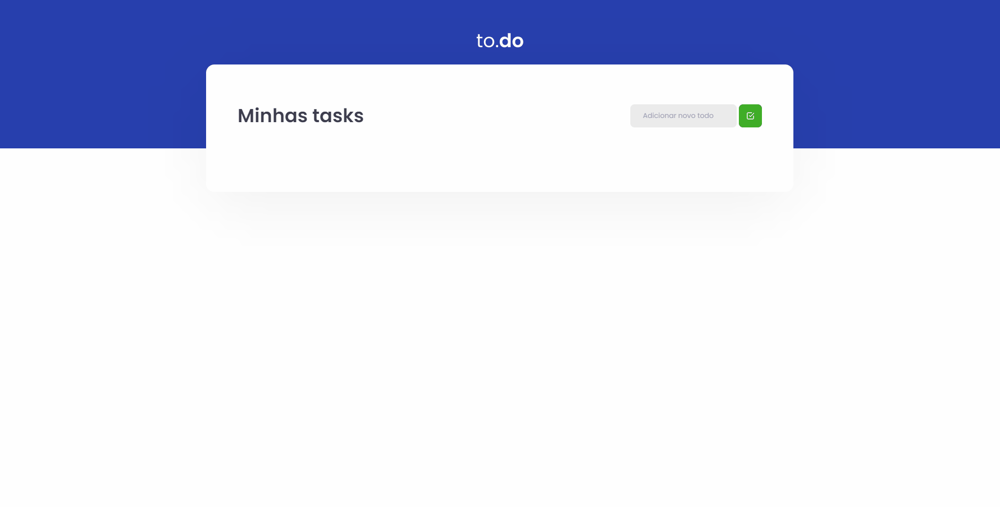

# <h1 align="center"></h1>

# Sobre

Desafio 01 do curso Ignite da <a href="https://rocketseat.com.br/">Rocketseat</a>

    Uma pequena aplicação de atividades a fazer, para treinar um pouco sobre manipulação
    do estado no React.

# 🚀 Tecnologias

<ul>
    <li>ReactJS</li>
    <li>TypeScript</li>
</ul>

# Instalação

<strong>
    Necessário ter o <a href="https://nodejs.org/en/">Node.js</a> instalado,
    um instalador de pacotes: <a href="https://www.npmjs.com/">Npm</a> ou <a href="https://yarnpkg.com/">Yarn</a>,
    para clonar o repositório use o <a href="https://git-scm.com/">Git</a>
</strong>

<pre>
# Clone o repositório
git clone https://github.com/pdrolucasz/ignite-to.do.git

# Instale as dependências
yarn ou npm install

# Inicie a aplicação
yarn dev ou npm run dev
</pre>

#

<h3 align="center">Made with 💜 by <a href="https://www.linkedin.com/in/pedro-lucas-4b2941199/">Pedro Lucas</a></h3>
